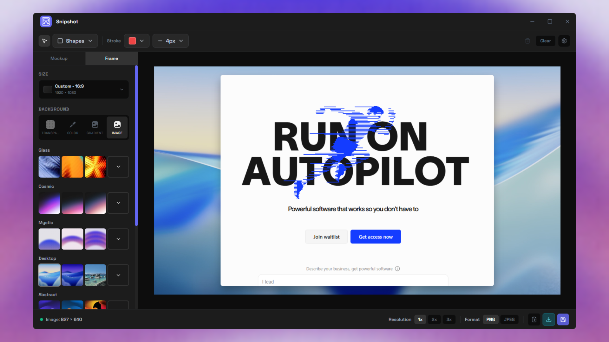

# Snipshot - Modern Screenshot Tool for Windows

A lightweight, feature-rich screenshot application built with Wails (Go + React). Capture, annotate, and export screenshots with a beautiful glassmorphism UI.

**90% smaller than Electron** (~10MB) | **Native performance** | **Rich annotation tools**



---

## ✨ Features

### 📸 Capture Modes

- **Fullscreen** - Capture all displays in one image
- **Region** - Drag to select custom rectangle area
- **Window** - Automatically detect and capture active window
- **Hotkey Triggered** - Global keyboard shortcuts (fully customizable)

### 🎨 Advanced Annotations

- **Shapes** - Rectangle, ellipse with full styling control
  - Border radius control for rectangles (0-50px)
  - Fill color with transparency support
  - Custom stroke colors and widths
- **Arrows & Lines** - Directional callouts and custom lines
  - Straight and curved arrow styles
  - Adjustable stroke width and colors
- **Text** - Rich text annotations
  - Multiple font sizes (16-96px)
  - Bold and italic formatting
  - Real-time text editing with multi-line support
  - Custom colors and opacity
- **Spotlight** - Highlight areas with dimmed backgrounds
- **Transforms** - Move, resize with corner handles, rotate support
- **Non-destructive** - Edit or delete annotations anytime
- **Opacity Control** - Adjust transparency for all annotations (0-100%)

### 🖼️ Editor Features

- **Background Options**
  - Transparent background
  - Solid colors with color picker
  - 24+ categorized gradient presets (Vibrant, Pastel, Dark, Cool, Warm, Nature)
  - Custom background image upload
- **Output Sizing**
  - Custom dimensions (width × height)
  - Social media presets (Instagram, Twitter, Facebook, LinkedIn, YouTube, TikTok)
  - Standard aspect ratios (16:9, 4:3, 1:1, 9:16, etc.)
- **Style Controls**
  - Padding adjustment (space around screenshot)
  - Corner radius for screenshot (0-50px)
  - Shadow depth control (0-30px)
- **Real-time Preview** - See all changes instantly
- **Settings Persistence** - Editor preferences saved across sessions

### 💾 Export Options

- **Formats** - PNG (lossless) and JPEG (with quality slider 0-100)
- **Output Ratios** - 9+ presets for different platforms
- **Quick Save** - Save to configured folder with auto-naming patterns
- **Background Control** - Include or exclude backgrounds in export
- **Perfect Export** - Exported image matches preview exactly

### 🔧 System Integration

- **System Tray** - Icon in taskbar for quick access
- **Global Hotkeys** - Customizable keyboard shortcuts
- **Auto-start Option** - Launch on Windows startup
- **Minimize to Tray** - Keep window out of the way
- **Auto-copy to Clipboard** - Optional automatic clipboard copy after capture

---

## 📸 Screenshots

_[Screenshots section - placeholder for visual examples]_

Coming soon. See GitHub releases for previews.

---

## 🚀 Installation

### Option 1: Portable Executable (Recommended)

1. Download `snipshot.exe` from [GitHub Releases](https://github.com/fabwaseem/snipshot/releases)
2. Run directly - no installation required
3. Optionally pin to taskbar or create shortcut

**Requirements:**

- Windows 10 or later
- WebView2 runtime (pre-installed on Windows 11, automatic install on Windows 10)

### Option 2: Installer

1. Download `snipshot_installer.exe` from [GitHub Releases](https://github.com/fabwaseem/snipshot/releases)
2. Run installer and follow prompts
3. Shortcuts created in Start menu and optional desktop

---

## 🎯 Quick Start

### Basic Workflow

1. **Launch** Snipshot (portable EXE or via Start menu)
2. **Capture** screenshot using one of:
   - Click toolbar buttons (Fullscreen, Region, Window)
   - Press global hotkey (default: Ctrl+PrintScreen for region)
   - Right-click system tray icon
3. **Annotate** (optional):
   - Select annotation tool from toolbar (Rectangle, Ellipse, Arrow, Line, Text, Spotlight)
   - Draw on screenshot
   - Adjust colors, stroke width, fill, border radius, and opacity
   - Click text annotations to edit content
4. **Style** (optional):
   - Adjust padding, corner radius, and shadow
   - Choose background (transparent, solid, gradient, or image)
   - Select output size from presets or custom dimensions
5. **Export**:
   - Choose PNG or JPEG format
   - Click Export or Quick Save
   - Confirm location (or auto-save to configured folder)

### Keyboard Shortcuts

| Shortcut                 | Action                              |
| ------------------------ | ----------------------------------- |
| `Ctrl+PrintScreen`       | Region capture (default)            |
| `PrintScreen`            | Fullscreen capture                  |
| `Ctrl+Shift+PrintScreen` | Window capture                      |
| `Ctrl+S`                 | Export screenshot                   |
| `V`                      | Select tool                         |
| `R`                      | Rectangle tool                      |
| `E`                      | Ellipse tool                        |
| `A`                      | Arrow tool                          |
| `L`                      | Line tool                           |
| `T`                      | Text tool                           |
| `S`                      | Spotlight tool                      |
| `Delete` / `Backspace`   | Delete selected annotation          |
| `Escape`                 | Cancel current operation / Deselect |

_Note: Global hotkeys are customizable in Settings → Hotkeys_

---

## ⚙️ Configuration

### Settings Dialog

Access via Settings icon in title bar (⚙️).

**Tabs:**

#### 🔑 Hotkeys

- **Fullscreen** - Default: PrintScreen
- **Region** - Default: Ctrl+PrintScreen
- **Window** - Default: Ctrl+Shift+PrintScreen
- Custom key combinations supported

#### 🚀 Startup

- **Launch on startup** - Auto-start Snipshot on Windows boot
- **Minimize to tray** - Start minimized instead of maximized
- **Show notifications** - Display toast when screenshot is saved

#### 💾 Quick Save

- **Folder** - Default: `%USERPROFILE%\Pictures\Snipshot`
- **Filename pattern** - Options: `timestamp`, `date`, `increment`

#### 📤 Export

- **Default format** - PNG or JPEG
- **JPEG quality** - 0-100 (default: 95)
- **Auto-copy to clipboard** - Automatically copy screenshot after capture

### Editor Settings

Panel on right side of editor (collapsible):

- **Size** - Custom dimensions or preset sizes for social media
- **Padding** - Space around screenshot (0-200px)
- **Border Radius** - Rounded corners for screenshot (0-50px)
- **Shadow Size** - Drop shadow depth (0-30px)
- **Background** - Select from:
  - Transparent (with preview border)
  - Solid colors (with color picker)
  - Gradient presets (24+ categorized options)
  - Custom background image upload

**Annotation Toolbar:**

- **Stroke** - Color picker and width selector (2-20px)
- **Fill** - Color picker for shapes (with "None" option)
- **Border Radius** - Slider for rectangles (0-50px)
- **Opacity** - Slider for all annotations (0-100%)
- **Text Controls** - Font size, bold, italic for text annotations
- **Arrow Controls** - Curve toggle for arrows

_All settings persist in browser localStorage and survive app restarts._

---

## 🛠️ Development

### Prerequisites

- **Go** 1.24.0+
- **Node.js** 18+
- **Wails CLI** - Install: `go install github.com/wailsapp/wails/v2/cmd/wails@latest`
- **WebView2 Runtime** - Pre-installed on Windows 11, or manual install on Windows 10

### Setup

```bash
# Clone repository
git clone https://github.com/fabwaseem/snipshot.git
cd snipshot

# Install frontend dependencies
cd frontend
npm install
cd ..

# Verify Wails setup
wails doctor
```

### Development Server

```bash
# Run with hot reload
wails dev
```

This starts the app with:

- Frontend: Vite dev server (auto-reload on code changes)
- Backend: Recompile on Go file changes
- Open in Wails dev window

**Frontend only:**

```bash
cd frontend
npm run dev
```

**Backend only:**

```bash
wails build
./build/bin/snipshot.exe
```

### Build

**Portable Executable:**

```bash
wails build
# Output: ./build/bin/snipshot.exe (~10-15MB)
```

**Installer (NSIS):**

```bash
wails build -nsis
# Output: ./build/bin/snipshot-amd64-installer.exe
```

**Release Build (optimized):**

```bash
wails build -upx
# Smaller binary (~7-10MB) using UPX compression
```

### Release

**Local Release (Recommended):**

```powershell
# PowerShell script (Windows)
.\scripts\release.ps1 [patch|minor|major]
# Example: .\scripts\release.ps1 patch
```

This script will:
1. Bump version in `package.json` (patch/minor/major)
2. Create a git tag
3. Build both portable executable and installer
4. Print instructions for creating GitHub release

**Manual Release Steps:**

```bash
# 1. Bump version
npm run version:bump [patch|minor|major]

# 2. Build release files
npm run build:release
# Or build separately:
# wails build -clean -platform windows/amd64
# wails build -platform windows/amd64 -nsis

# 3. Commit and push
git add .
git commit -m "chore: release v1.1.0"
git push origin main --tags

# 4. Create GitHub release manually:
# - Go to https://github.com/fabwaseem/snipshot/releases/new
# - Select the new tag (v1.1.0)
# - Upload build/bin/snipshot.exe
# - Upload build/bin/snipshot-amd64-installer.exe
```

### Project Structure

```
.
├── app.go                          # Wails bindings (Go)
├── main.go                         # Entry point
├── wails.json                      # Wails config
├── go.mod / go.sum                 # Go dependencies
├── frontend/
│   ├── src/
│   │   ├── App.tsx                 # Root React component
│   │   ├── components/             # React components
│   │   │   ├── annotation-toolbar.tsx
│   │   │   ├── background-selector.tsx
│   │   │   ├── capture-widget.tsx
│   │   │   ├── color-picker-dropdown.tsx
│   │   │   ├── export-toolbar.tsx
│   │   │   ├── html-editor-canvas.tsx
│   │   │   ├── image-uploader.tsx
│   │   │   ├── media-uploader.tsx
│   │   │   ├── settings-panel.tsx
│   │   │   ├── settings-modal.tsx
│   │   │   ├── size-dropdown.tsx
│   │   │   ├── stroke-width-dropdown.tsx
│   │   │   ├── title-bar.tsx
│   │   │   ├── tools-dropdown.tsx
│   │   │   └── status-bar.tsx
│   │   ├── types/                  # TypeScript interfaces
│   │   ├── assets/                 # Images, fonts
│   │   ├── colors.ts               # Color palette definitions
│   │   └── style.css               # Global styles
│   ├── package.json
│   ├── vite.config.ts
│   ├── tailwind.config.js
│   └── tsconfig.json
├── internal/                       # Go packages
│   ├── config/                     # Config persistence
│   ├── hotkeys/                    # Global hotkey registration
│   ├── screenshot/                 # Screen/window capture
│   ├── tray/                       # System tray integration
│   └── windows/                    # Window enumeration
├── docs/                           # Documentation
└── build/                          # Build assets & output
```

---

## 🏗️ Architecture

### Backend (Go)

**Key Packages:**

- `internal/config` - JSON config persistence
- `internal/hotkeys` - Global hotkey registration via Win32 API
- `internal/screenshot` - Multi-display screen capture
- `internal/tray` - System tray icon + context menu
- `internal/windows` - Window enumeration

**Wails Bindings:**
25+ methods exposed to frontend via automatic Go→TypeScript binding.

### Frontend (React)

**Technology Stack:**

- React 18.2 + TypeScript
- html2canvas for export rendering
- Tailwind CSS 3.4 for styling
- Vite 3.0 for build tooling
- Lucide React for icons

**Components:**
16 specialized components for UI, toolbars, dialogs, canvas, and annotations.

**State Management:**
React hooks (useState, useEffect, useCallback) + localStorage for persistence.

### Communication

Frontend ↔ Go via **Wails IPC** (automatic JSON serialization).

Example:

```typescript
// Frontend
const result = await CaptureFullscreen();
// Automatically calls Go method, returns JSON-deserialized CaptureResult
```

See [`docs/system-architecture.md`](./docs/system-architecture.md) for detailed architecture diagrams.

---

## 📦 Tech Stack

| Layer          | Technology         | Purpose                         |
| -------------- | ------------------ | ------------------------------- |
| **Framework**  | Wails v2.11.0      | Desktop app framework           |
| **Backend**    | Go 1.24.0          | System APIs, screenshot capture |
| **Frontend**   | React 18.2.0       | UI framework                    |
| **Language**   | TypeScript 5.3.0   | Type-safe frontend              |
| **Export**     | html2canvas 1.4.1  | Canvas to image conversion      |
| **Styling**    | Tailwind CSS 3.4.0 | Utility-first CSS               |
| **Build**      | Vite 3.0.7         | Frontend bundler                |
| **Icons**      | Lucide React 0.555 | Icon library                    |
| **Screenshot** | kbinani/screenshot | Multi-display capture           |

---

## 🤝 Contributing

Contributions are welcome! Please follow these steps:

1. **Fork** the repository
2. **Create** a feature branch: `git checkout -b feature/amazing-feature`
3. **Commit** your changes: `git commit -m 'Add amazing feature'`
4. **Push** to the branch: `git push origin feature/amazing-feature`
5. **Open** a Pull Request

**Guidelines:**

- Follow [code standards](./docs/code-standards.md)
- Update tests for new features
- Update documentation as needed
- Keep commits focused and descriptive
- Use conventional commit messages

**Development Workflow:**

1. Make changes
2. Test thoroughly
3. Ensure code passes linting
4. Update relevant documentation
5. Submit PR with clear description

---

## 🗺️ Roadmap

### v1.0 (Completed) ✅

- ✅ Basic capture modes (Fullscreen, Region, Window)
- ✅ Simple annotations (Rectangle, Ellipse)
- ✅ PNG export
- ✅ Configuration dialog
- ✅ System tray integration
- ✅ Global hotkey support

### v1.1 (Completed) ✅

- ✅ Advanced annotations (Arrow, Line, Text, Spotlight)
- ✅ Non-destructive editing with selection handles
- ✅ Gradient backgrounds (24+ presets)
- ✅ JPEG export with quality control
- ✅ Output aspect ratios and custom dimensions
- ✅ Border radius and fill controls
- ✅ Opacity controls for all annotations
- ✅ Real-time text editing
- ✅ Background image support

### v1.2 (Planned)

- 🔄 Undo/redo functionality
- 🔄 Keyboard shortcuts reference overlay
- 🔄 Dark/light theme toggle
- 🔄 Copy annotations between screenshots
- 🔄 Export history

### v2.0 (Future)

- 📋 Screen recording capabilities
- 📋 OCR text extraction
- 📋 Cloud sync for settings
- 📋 macOS/Linux support
- 📋 Plugin system
- 📋 Batch processing

See [`docs/project-overview-pdr.md`](./docs/project-overview-pdr.md) for detailed roadmap.

---

## 🐛 Troubleshooting

### Common Issues

**Global hotkeys not working**

- Ensure app has focus once (may require privilege elevation)
- Check Settings → Hotkeys for conflicts with other apps
- Try alternative key combinations
- Restart the application

**Screenshots appear blurry**

- Confirm DPI scaling in Windows Settings (125%, 150%)
- App handles DPI automatically; if issues persist, file a bug report
- Use PNG format for best quality
- Check display scaling settings

**App crashes on startup**

- Delete `%APPDATA%\Snipshot\config.json` to reset configuration
- Check if WebView2 runtime is installed (Windows 10)
- Restart computer and try again
- Check Windows Event Viewer for detailed error logs

**Export takes too long**

- Large images (4K+) may take 500-800ms
- Reduce output size via aspect ratio control
- Use JPEG format for faster export than PNG
- Close other resource-intensive applications

**Annotations not appearing**

- Ensure you're using the correct tool from the toolbar
- Check that the annotation color is visible against the background
- Verify opacity is set above 0%
- Try selecting the annotation to see if it's there

**Text editing not working**

- Click on text annotation to select it
- Click again or double-click to edit
- Press Escape to cancel editing
- Ensure text tool or select tool is active

### Debug Mode

Enable debug logging:

```bash
wails dev  # Prints Go errors and exceptions to console
```

Check browser console (F12) for frontend errors in dev mode.

---

## 📄 License

BSD 3-Clause License

See [LICENSE](./LICENSE) file for details.

---

## 💬 Support & Feedback

- **Issues**: [GitHub Issues](https://github.com/fabwaseem/snipshot/issues)
- **Discussions**: [GitHub Discussions](https://github.com/fabwaseem/snipshot/discussions)
- **Feature Requests**: Open an issue with the `enhancement` label

---

## 🙏 Acknowledgments

- [Wails](https://wails.io/) - Desktop framework
- [kbinani/screenshot](https://github.com/kbinani/screenshot) - Screen capture library
- [html2canvas](https://html2canvas.hertzen.com/) - Canvas to image conversion
- [Tailwind CSS](https://tailwindcss.com/) - Styling framework
- [Lucide](https://lucide.dev/) - Beautiful icon library
- [React](https://react.dev/) - UI framework

---

## 📝 Changelog

### v1.1.0 (2025-01-XX)

- ✨ Add arrow and line annotations with curve support
- ✨ Add text annotation tool with real-time editing
- ✨ Add spotlight annotation tool
- ✨ Implement selection handles with resize and move
- ✨ Add border radius control for rectangles
- ✨ Add fill color control for shapes
- ✨ Add opacity control for all annotations
- ✨ Add 24+ gradient background presets (categorized)
- ✨ Add background image upload support
- ✨ Support multiple output aspect ratios and custom dimensions
- ✨ Add social media preset sizes
- ✨ Improve export accuracy to match preview exactly
- 🚀 Performance improvements for large images
- 🎨 Enhanced UI with better toolbar layout
- 📝 Complete documentation suite

### v1.0.0 (2025-12-11)

- 🎉 Initial release
- ✅ Fullscreen, region, and window capture
- ✅ Rectangle and ellipse annotations
- ✅ PNG export
- ✅ Configuration dialog
- ✅ System tray integration
- ✅ Global hotkey support

---

**Made with ❤️ for screenshot enthusiasts**

---

## ⭐ Star History

If you find Snipshot useful, please consider giving it a star on GitHub!

---

## 📊 Project Status


---

**Enjoy capturing and annotating your screenshots! 🎨📸**
